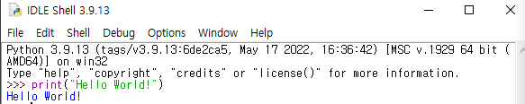
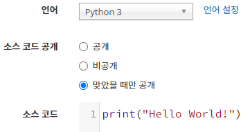
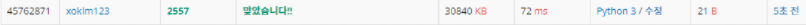
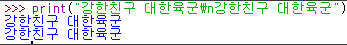
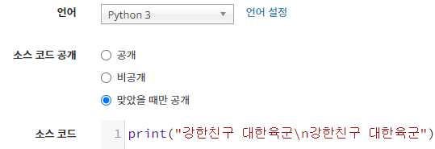
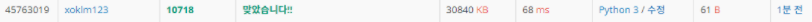

# 👨‍💻 BACKJOON 단계별 문제풀기 1일차(하루 2문제)

## ⭐ 1단계 입출력과 사칙연산 (언어 : python3)

### 1. 2557번 문제 : Hello World! 출력 

[백준 2557번 문제 출처](https://www.acmicpc.net/problem/2557)

### 2. 10718번 문제 : 두 줄에 걸쳐 "강한친구 대한육군"을 한 줄에 한 번씩 출력한다.

❓**줄 바꿈은 \n 로 할 수 있다.**

[백준 10718번 문제 출처](https://www.acmicpc.net/problem/10718)