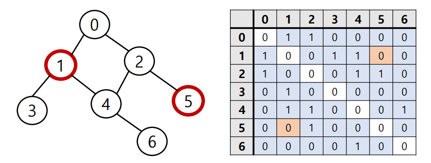

# 그래프

* 정점과 이를 연결하는 간선들의 집합으로 이루어진 비선형 자료구조
  * 소셜 네트워크와 지하철 노선도 같이, 현실에 있는 개체 간의 관례를 나타내기 위해 사용.
* 정점 : 간선으로 연결되는 객체 , 노드라고도 함
* 간선 : 정점 간의 관계(연결)를 표현하는 선을 의미, 엣지(Edge)라고도 함.
* 경로 : 시작 정점부터 도착 정점까지 거치는 정점을 나열한 것을 의미
* 인접 : 두 개의 정점이 하나의 간선으로 직접 연결된 상태

## 1. 무방향 그래프


* 간선의 방향이 없는 가장 일반적 그래프
* 간선을 통해 양방향의 정점(노드) 이동 가능
* 차수(Degree) : 하나의 정점에 연결된 간선의 개수
* 모든 정점(노드)의 차수의 합 = 간선 수 x 2

## 2 (유)방향 그래프


- 간선의 방향이 있는 그래프
- **간선이 방향이 가리키는 정점(노드)로 이동 가능** 
  - 방향이 정해져있기 때문에 갈 수 있는 곳이 정해져있다.
- 차수(Degree) : 진입 차수와 진출 차수로 나누어짐
  - 진입 차수 : 외부 정점에서 한 정점으로 들어오는 간선의 수
  - 지출 차수 : 한 정점에서 외부 정점으로 나가는 간산의 수

-----------------------------------------------------------------------------------------------------------

# 그래프의 표현 

### 1. 인접 행렬

* 두 정점을 연결하는 간선이 없으면 0, 있으면 1을 가지는 행렬로 표현하는 방식.

* 무방향 그래프 기준

  * 간선이 있는 경우

  

* 간선이 없는 경우




```
# 입력
0 1
0 2
1 3
1 4
2 4
2 5
4 6
```

```
# 인접 행렬 만들기
n = 7 # 정점 개수
m = 7 # 간선 개수
graph = [[0] * n for _ in range(n)]
for _ in range(m):
    v1, v2 = map(int, input().split())
    graph[v1][v2] = 1
    graph[v2][v1] = 1
print(graph)
```


```
graph = [
[0, 1, 1, 0, 0, 0, 0],
[1, 0, 0, 1, 1, 0, 0],
[1, 0, 0, 0, 1, 1, 0],
[0, 1, 0, 0, 0, 0, 0],
[0, 1, 1, 0, 0, 0, 1],
[0, 0, 1, 0, 0, 0, 0],
[0, 0, 0, 0, 1, 0, 0]
]
```


### 2. 인접리스트

* 리스트를 통해 각 정점에 대한 인접 정점들을 순차적으로 표현하는 방식.
* 


```
# 입력
0 1
0 2
1 3
1 4
2 4
2 5
4 6

# 인접 리스트 만들기
n = 7 # 정점 개수
m = 7 # 간선 개수
graph = [[] for _ in range(n)]
for _ in range(m):
    v1, v2 = map(int, input().split())
    graph[v1].append(v2)
    graph[v2].append(v1)
print(graph)
#결과
# graph = [
[1, 2],
[0, 3, 4],
[0, 4, 5],
[1],
[1, 2, 6],
[2],
[4]
]
```

**인접 행렬은 직관적이고 만들기 편하지만, 불필요하게 공간이 낭비된다**

**인접 리스트는 연결된 정점만 저장하여 효율적이므로 자주 사용됨.**
