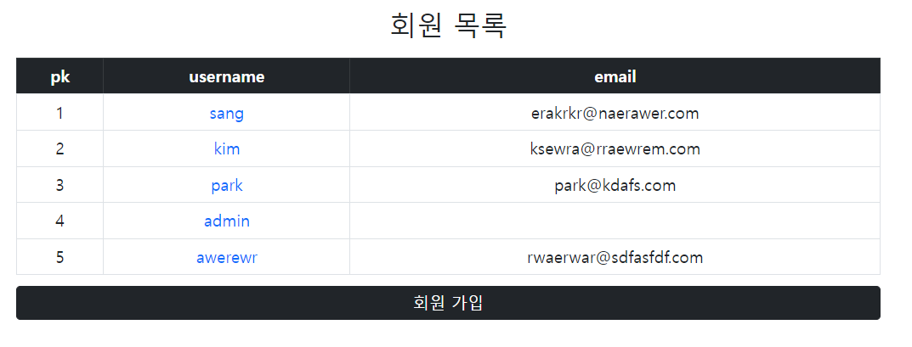
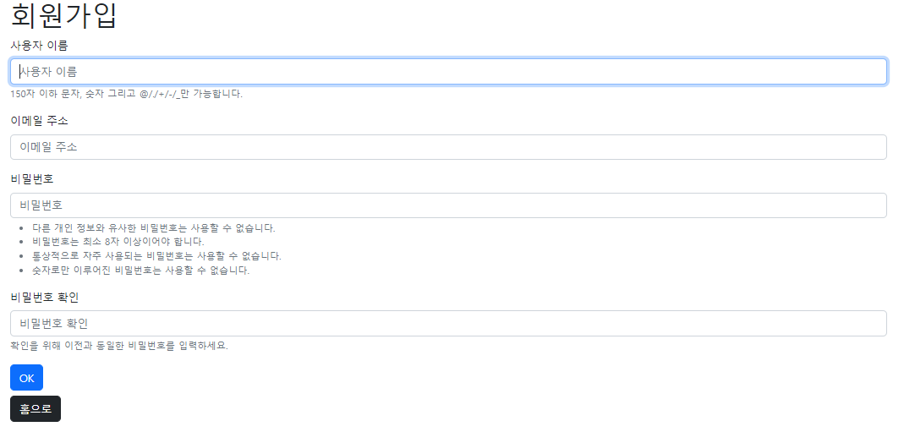
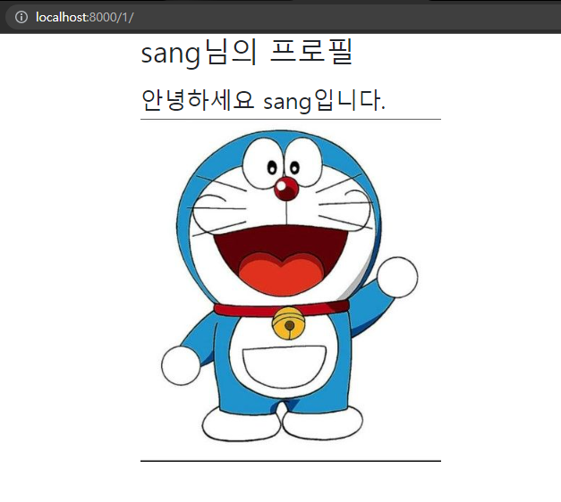

## 요구사항

### 모델 Model

- 모델 이름 : User

  Django **AbstractUser** 모델 상속

### **폼 Form**

- Django 내장 회원가입 폼 UserCreationForm을 상속받은 CustomUserCreationForm 생성 후 활용

  해당 폼은 아래 필드만 출력합니다.

  - username
  - email
  - password1
  - password2

### 기능 View

회원가입 Create

- `POST` http://127.0.0.1:8000/accounts/signup/
- CustomUserCreationForm을 활용해서 회원가입 구현

회원 목록 조회 Read(index)

- `GET` http://127.0.0.1:8000/accounts/

회원 정보 조회 Read(detail)

- `GET` http://127.0.0.1:8000/accounts/<user_pk>/

### 화면 Template

메인페이지

- `GET` http://127.0.0.1:8000/

- 회원 목록 테이블

- 회원가입 페이지 이동 버튼

  

회원가입 페이지

- `GET` http://127.0.0.1:8000/signup/

- 회원가입 폼 ****

  

회원 조회 페이지(프로필 페이지)

* http://127.0.0.1:8000/<user_pk>/

- 회원 정보 출력

### ✍ 후기 

처음 할 때는 좀 헤맨 감이 있었으나, 라이브 강의와 자료를 이용하여 복습하니 이해가 되었다. 직접 실습을 해보았고 이것저것 꾸미지는 못했지만 실습 진행하는 동안 재미있게 했던 것 같다!.

