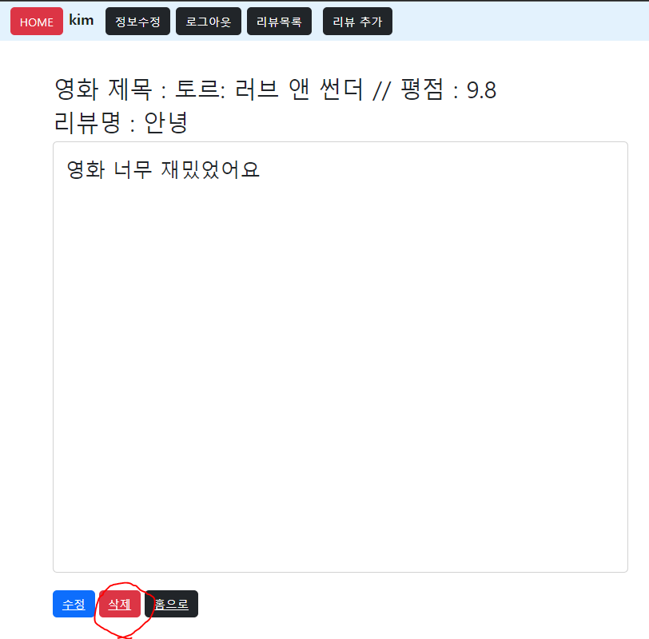

### 3. 회원가입

branch accounts/signup

앱 App

앱 이름 : accounts

모델 Model

모델 이름 : User

- Django **AbstractUser** 모델 상속

**폼 Form**

- Django 내장 회원가입 폼 UserCreationForm을 상속 받아서 CustomUserCreationForm 작성

  해당 폼은 아래 필드만 출력합니다.

  - username
  - password1
  - password2

**기능 View**

회원가입

- `POST` http://127.0.0.1:8000/accounts/signup/
- CustomUserCreationForm을 활용해서 회원가입 구현

**화면 Template**

회원가입 페이지

- `GET` http://127.0.0.1:8000/accounts/signup/
- 회원가입 폼
- 

------

### 4. 로그인

branch accounts/login

**폼 Form**

로그인

- Django 내장 로그인 폼 **AuthenticationForm 활용**

**기능 View**

로그인

- `POST` http://127.0.0.1:8000/accounts/login/
- **AuthenticationForm**를 활용해서 로그인 구현

**화면 Template**

로그인 페이지

- `GET` http://127.0.0.1:8000/accounts/login/
- 로그인 폼
- 회원가입 페이지 이동 버튼
- 

------

### 5. 회원 목록 조회

`branch` accounts/index

**기능 View**

회원 목록 조회

- `GET` http://127.0.0.1:8000/accounts/

**화면 Template**

회원 목록 페이지

- `GET` http://127.0.0.1:8000/accounts/
- 회원 목록 출력
- 회원 아이디를 클릭하면 해당 회원 조회 페이지로 이동
- 

------

### 6. 회원 정보 조회

`branch` accounts/detail

**기능 View**

회원 정보 조회

- `GET` http://127.0.0.1:8000/accounts/[int:user_pk](int:user_pk)/

**화면 Template**

회원 조회 페이지(프로필 페이지)

- `GET` http://127.0.0.1:8000/accounts/[int:user_pk](int:user_pk)/
- 

------

### 7. 회원 정보 수정

branch accounts/update

**폼 Form**

회원 정보 수정

- Django 내장 회원 수정 폼 UserChangeForm을 상속 받아서 **CustomUserChangeForm** 작성

  해당 폼은 아래 필드만 출력합니다.

  - first_name
  - last_name
  - email

**기능 View**

회원 정보 수정

- `POST` http://127.0.0.1:8000/accounts/update/

**화면 Template**

회원 정보 수정 페이지

- `GET` http://127.0.0.1:8000/accounts/update/

------

### 8. 로그아웃

branch accounts/logout

**기능 View**

로그아웃

- `POST` http://127.0.0.1:8000/accounts/logout/

------

### 9. 네비게이션바

branch template/navbar

**화면 Template**

**네비게이션바**

- 리뷰 목록 페이지 이동 버튼
- 리뷰 작성 페이지 이동 버튼
- 비 로그인 유저는 작성 버튼 출력 X
- 로그인 상태에 따라 다른 화면 출력
  1. 로그인 상태
     - 로그인 한 사용자의 username 출력
       - username을 클릭하면 회원 조회 페이지로 이동
     - 로그아웃 버튼
  2. 비 로그인 상태
     - 로그인 페이지 이동 버튼
     - 회원가입 페이지 이동 버튼
     
     

------

### 10. 리뷰 생성

branch reviews/create

**앱 App**

앱 이름 : reviews

모델 Model

모델 이름 : Review

- 모델 필드

  | 이름       | 역할          | 필드     | 속성              |
  | ---------- | ------------- | -------- | ----------------- |
  | title      | 리뷰 제목     |          |                   |
  | content    | 리뷰 내용     |          |                   |
  | movie_name | 영화 이름     |          |                   |
  | grade      | 영화 평점     |          |                   |
  | created_at | 리뷰 생성시간 | DateTime | auto_now_add=True |
  | updated_at | 리뷰 수정시간 | DateTime | auto_now = True   |

**기능 View**

데이터 생성

- `POST` http://127.0.0.1:8000/reviews/create/

**화면 Template**

**리뷰 작성 페이지**

- `GET` http://127.0.0.1:8000/reviews/create/
- 리뷰 작성 폼

------

### 11. 리뷰 목록 조회

branch reviews/index

**기능 View**

데이터 목록 조회

- `POST` http://127.0.0.1:8000/reviews/

**화면 Template**

리뷰 **목록 페이지**

- `GET` http://127.0.0.1:8000/reviews/
- 리뷰 목록 출력
- 제목을 클릭하면 해당 리뷰의 정보 페이지로 이동
- 

------

### 12. 리뷰 정보 조회

branch reviews/detail

**기능 View**

데이터 정보 조회

- `GET` http://127.0.0.1:8000/reviews/[int:review_pk](int:review_pk)/

**화면 Template**

**리뷰 정보 페이지**

- `GET` http://127.0.0.1:8000/reviews/[int:review_pk](int:review_pk)/
- 해당 리뷰 정보 출력
- 수정 / 삭제 버튼
- 

------

### 13. 리뷰 정보 수정

branch reviews/update

**기능 View**

데이터 수정

- `POST` http://127.0.0.1:8000/reviews/[int:review_pk](int:review_pk)/update/

**화면 Template**

**리뷰 수정 페이지**

- `GET` http://127.0.0.1:8000/reviews/[int:review_pk](int:review_pk)/update/
- 리뷰 수정 폼

------

### 14. 리뷰 삭제

branch reviews/delete

**기능 View**

데이터 삭제

- `POST` http://127.0.0.1:8000/reviews/[int:review_pk](int:review_pk)/delete/

------

이후 팀원 간 논의하여 적절한 브랜치 이름을 정하여 개발합니다.