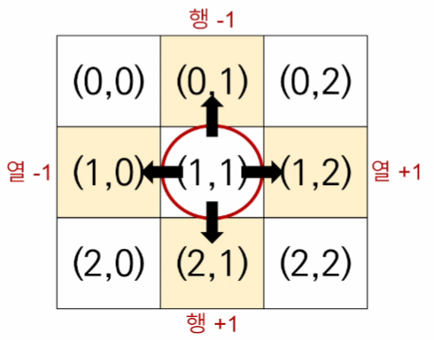

## 이차원 리스트의 회전

* 회전할 이차원 리스트가 들어갈 => 0을 넣은 공간(리스트)을 따로 생성
  * **손으로 써서 과정을 이해하자.**

```
#! 왼쪽으로 90도 회전

matrix = [
    [1,2,3],
    [4,5,6],
    [7,8,9]
]
n = 3
rotated_matrix = [[0] * n for _ in range(n)]
#for _ in range(2) <= 180도 회전 range(3)이면 270도..... 90도씩 늘어남.
for i in range(n):
    for j in range(n):
        rotated_matrix[i][j] = matrix[j][n-i-1]
print(rotated_matrix)
```

```
#! 오른쪽으로 90도 회전

matrix = [
    [1,2,3],
    [4,5,6],
    [7,8,9]
]
n = 3
rotated_matrix = [[0] * n for _ in range(n)]

for i in range(n):
    for j in range(n):
        rotated_matrix[i][j] = matrix[n-j-1][i]
print(rotated_matrix)
```


# ⭐완전탐색

* 무식하게 풀기(다해보기) [Brute-force]
* 델타 탐색 [Delta search]

## 1. Brute-force

* 모든 경우의 수를 탐색하여 문제를 해결하는 방식
  * 무식하게 밀어붙인다는 뜻
  * 가장 단순한 풀이 기법, 단순 조건문과 반복문을 이용해서 풀기
  * 복잡한 알고리즘 보다는, 아이디어를 어떻게 코드로 구현할 것인지가 중요하다.

EX) 백준 문제 예제 - 블랙잭(https://www.acmicpc.net/problem/2798) - 3중 for문...중복하지 않기 때문에 range설정을 잘 해줘야함

## 2. 델타 탐색

* 이차원 리스트의 모든 원소 순회하며, 각 지점에서 상하좌우에 위치한 다른 지점을 조회하거나 이동하는 방식.
* 상하좌우 탐색할 때 행과 열의 변화값인 -1,+1을 델타 값이라고 한다.
  * .(1,1) => (0,1) , (1,2), (2,1), (1,0)



* ```
  # 델타값 정의
  dx = [-1,1,0,0]
  dy = [0,0,-1,1]
  delta = [(-1,0),(1,0),(0,-1),(0,1)]
  
  # 이차원 리스트 순회
  for x in range(n):
  	for y in range(m):
  
  
  # 1. 델타값 이용해서 상하좌우 이동
  for i in range(4):
  	nx = x + dx[i]
  	ny = y + dy[i]
  	
  	# 2. 범위를 벗어나지 않을 때에만 갱신 (중요함)
  	if 0 <= nx < 3 and 0 <= ny < 3:
  		x = nx
  		y = ny
  ```

  
