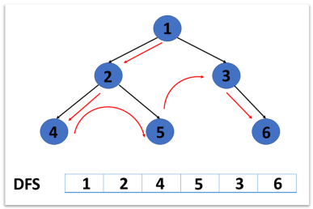

## 깊이 우선 탐색(DFS)

* 시작 정점부터 갈 수 있는 하위 정점까지 가장 깊게 탐색함

* 더 이상 갈 곳이 없다면 마지막 갈림길로 돌아와서 다른 정점 탐색

  * 결국 모든 정점을 방문함

  

* 경우의 수, 순열과 조합 문제에서 유용
  * 모든 정점을 방문할 필요가 없거나 최단 거리를 구하는 경우 너비우선탐색(BFS)이 유리

* 탐색을 진행할 그래프가 필요함(인접 행렬 또는 인접 리스트)

[DFS 사이클]

| 정점           | 0    | 1     | 2     | 3     | 4     | 5     | 6     |
| -------------- | ---- | ----- | ----- | ----- | ----- | ----- | ----- |
| **Visited[i]** | True | False | False | False | False | False | False |

1. 현재 정점 방문처리(True) 방문하지 않은 정점은 False
2. 인접한 모든 정점 확인
3. 방문하지 않은 인접 정점 이동


```
visited = [False] * (n+1) # 방문 처리 리스트
stack = [1] # 반복 조건을 위한 stack에 1 저장
visited[0] = True # 시작 정점 방문 처리

while stack:
    cur = stack.pop()
        
    for adj in graph[cur]:
        if visited[adj] == False:
            visited[adj] = True
            stack.append(adj)
            cnt += 1
print(cnt)

```

```
# 함수용
visited = [False] * n # 방문 처리 리스트

visited[start] = True # 시작 정점 방문 처리
stack = [start] # 돌아갈 곳을 기록

while stack: # 스택이 빌 때까지 반복 / 돌아갈 곳이 없을 때까지
  cur = stack.pop() # 현재 방문 정점 /후입선출

  for adj in graph[cur]: # 인접한 모든 정점에 대해
    if not visited[adj]: # 아직 방문하지 않았다면
      visited[adj] = True # 방문 처리
      stack.append(adj) # 스택에 넣기


'''
# cur가 0이라면
cur = 0

for adj in graph[cur]:  >>> 1, 2
    if not visited[adj]:  >>> 1
      visited[adj] = True  >>> 1
      stack.append(adj)  >>> 1
```
